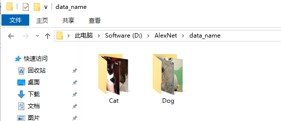
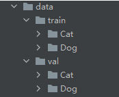
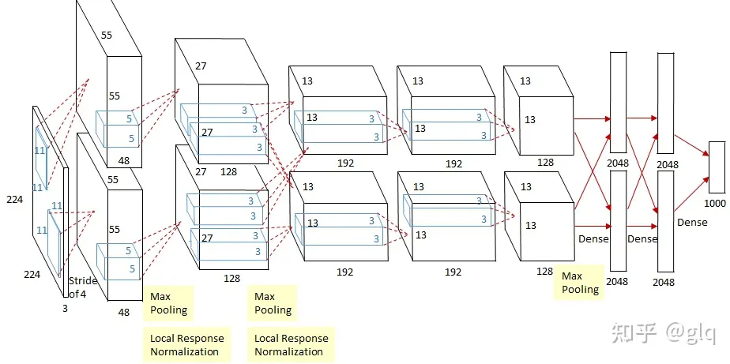
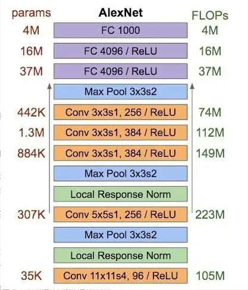
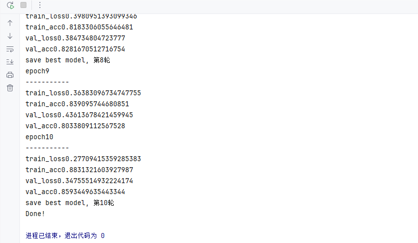
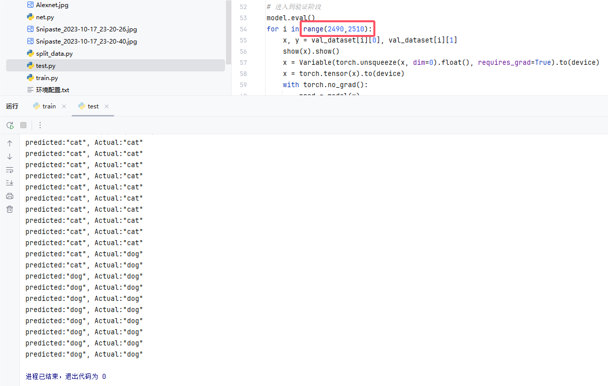
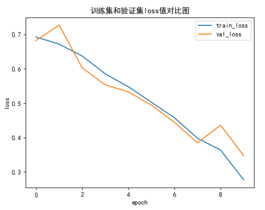
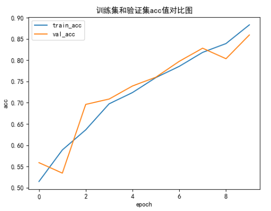

# 搭建AlexNet网络模型训练自己的数据集（猫狗分类）

## 配置环境

使用代码之前请先确保电脑上已经安装好了anaconda和pycharm。

### Conda加速推荐

```
conda config --add channels https://mirrors.ustc.edu.cn/anaconda/pkgs/main/

conda config --add channels https://mirrors.ustc.edu.cn/anaconda/pkgs/free/

conda config --add channels https://mirrors.bfsu.edu.cn/anaconda/cloud/pytorch/

conda config --set show_channel_urls yes

pip config set global.index-url <https://mirrors.ustc.edu.cn/pypi/web/simple>
```

### 代码环境配置

```
conda create -n alexnet python=3.10

conda activate alexnet

conda install pytorch torchvision torchaudio pytorch-cuda=11.8 -c pytorch -c nvidia

cd 自己本地的代码目录 （或者在本地代码目录的上方打开cmd）

pip install -r requirements.txt
```

## 数据准备

很多例子做图像分类的时候都喜欢用手写数字作为例子来讲解图像分类，这是一个及其不负责任的教学，我个人认为做深度学习有时候是要在数据集上下功夫的，而且因为很多框架都内置了手写数字数据集，并且已经给我们处理好了，直接可以导入到神经网络中用了，因此整个实验下来，我们连数据是什么样子都不知道，更别提学完之后去训练自己的数据集了。

这里我用的是猫狗分类的数据集，如下图所示：



利用split_data.py将数据集划分为训练集和验证集

```python
import os
from shutil import copy
import random


def mkfile(file):
    if not os.path.exists(file):
        os.makedirs(file)


# 获取data文件夹下所有文件夹名（即需要分类的类名）
file_path = 'D:/AlexNet/data_name'
flower_class = [cla for cla in os.listdir(file_path)]

# 创建 训练集train 文件夹，并由类名在其目录下创建5个子目录
mkfile('data/train')
for cla in flower_class:
    mkfile('data/train/' + cla)

# 创建 验证集val 文件夹，并由类名在其目录下创建子目录
mkfile('data/val')
for cla in flower_class:
    mkfile('data/val/' + cla)

# 划分比例，训练集 : 验证集 = 9 : 1
split_rate = 0.2

# 遍历所有类别的全部图像并按比例分成训练集和验证集
for cla in flower_class:
    cla_path = file_path + '/' + cla + '/'  # 某一类别的子目录
    images = os.listdir(cla_path)  # iamges 列表存储了该目录下所有图像的名称
    num = len(images)
    eval_index = random.sample(images, k=int(num * split_rate))  # 从images列表中随机抽取 k 个图像名称
    for index, image in enumerate(images):
        # eval_index 中保存验证集val的图像名称
        if image in eval_index:
            image_path = cla_path + image
            new_path = 'data/val/' + cla
            copy(image_path, new_path)  # 将选中的图像复制到新路径

        # 其余的图像保存在训练集train中
        else:
            image_path = cla_path + image
            new_path = 'data/train/' + cla
            copy(image_path, new_path)
        print("\r[{}] processing [{}/{}]".format(cla, index + 1, num), end="")  # processing bar
    print()

print("processing done!")

```

划分后的数据集如下图所示，训练集中和验证集中都有一定比例的猫和狗的照片



## AlexNet网络模型基本结构

AlexNet输入为RGB三通道的224 × 224 × 3大小的图像（也可填充为227 × 227 × 3 ）。AlexNet 共包含5 个卷积层（包含3个池化）和 3 个全连接层。其中，每个卷积层都包含卷积核、偏置项、ReLU激活函数和局部响应归一化（LRN）模块。第1、2、5个卷积层后面都跟着一个最大池化层，后三个层为全连接层。最终输出层为softmax，将网络输出转化为概率值，用于预测图像的类别。



#### 1、卷积+池化层（前五层）

AlexNet共有五个卷积层，每个卷积层都包含卷积核、偏置项、ReLU激活函数和局部响应归一化（LRN）模块。

卷积层C1：使用96个核对224 × 224 × 3的输入图像进行滤波，卷积核大小为11 × 11 × 3，步长为4。将一对55×55×48的特征图分别放入ReLU激活函数，生成激活图。激活后的图像进行最大池化，size为3×3，stride为2，池化后的特征图size为27×27×48（一对）。池化后进行LRN处理。

卷积层C2：使用卷积层C1的输出（响应归一化和池化）作为输入，并使用256个卷积核进行滤波，核大小为5 × 5 × 48。

卷积层C3：有384个核，核大小为3 × 3 × 256，与卷积层C2的输出（归一化的，池化的）相连。

卷积层C4：有384个核，核大小为3 × 3 × 192。

卷积层C5：有256个核，核大小为3 × 3 × 192。卷积层C5与C3、C4层相比多了个池化，池化核size同样为3×3，stride为2。

其中，卷积层C3、C4、C5互相连接，中间没有接入池化层或归一化层。

#### 2、全连接层（后三层）

全连接层F6：因为是全连接层，卷积核size为6×6×256，4096个卷积核生成4096个特征图，尺寸为1×1。然后放入ReLU函数、Dropout处理。值得注意的是AlexNet使用了Dropout层，以减少过拟合现象的发生。

全连接层F7：同F6层。

全连接层F8：最后一层全连接层的输出是1000维softmax的输入，softmax会产生1000个类别预测的值。



## 利用pytorch搭建AlexNet网络模型

```python
import torch
from torch import nn
import torch.nn.functional as F
# 定义网络结构, 继承nn.Module, 实现forward函数, 输入为x, 输出为y, 输入为[1, 3, 224, 224],
class MyAlexNet(nn.Module):
    def __init__(self):
        super(MyAlexNet, self).__init__()

        self.c1 = nn.Conv2d(in_channels=3, out_channels=48, kernel_size=11, stride=4, padding=2)
        self.ReLU = nn.ReLU()
        self.c2 = nn.Conv2d(in_channels=48, out_channels=128, kernel_size=5, stride=1, padding=2)
        self.s2 = nn.MaxPool2d(2)
        self.c3 = nn.Conv2d(in_channels=128, out_channels=192, kernel_size=3, stride=1, padding=1)
        self.s3 = nn.MaxPool2d(2)
        self.c4 = nn.Conv2d(in_channels=192, out_channels=192, kernel_size=3, stride=1, padding=1)
        self.c5 = nn.Conv2d(in_channels=192, out_channels=128, kernel_size=3, stride=1, padding=1)
        self.s5 = nn.MaxPool2d(kernel_size=3, stride=2)
        self.flatten = nn.Flatten()
        self.f6 = nn.Linear(4608, 2048)
        self.f7 = nn.Linear(2048, 2048)
        self.f8 = nn.Linear(2048, 1000)
        self.f9 = nn.Linear(1000, 2)

    def forward(self, x):
        x = self.ReLU(self.c1(x))
        x = self.ReLU(self.c2(x))
        x = self.s2(x)
        x = self.ReLU(self.c3(x))
        x = self.s3(x)
        x = self.ReLU(self.c4(x))
        x = self.ReLU(self.c5(x))
        x = self.s5(x)
        x = self.flatten(x)
        x = self.f6(x)
        x = F.dropout(x, p=0.5)
        x = self.f7(x)
        x = F.dropout(x, p=0.5)
        x = self.f8(x)
        x = F.dropout(x, p=0.5)

        x = self.f9(x)
        return x

if __name__ == '__mian__':
    x = torch.rand([1, 3, 224, 224])
    model = MyAlexNet()
    y = model(x)
```

## 训练网络模型代码

```python
import os
import torch
import numpy as np
from torch import nn
from net import MyAlexNet
from torch.optim import lr_scheduler
from torchvision import transforms
from torchvision.datasets import ImageFolder
from torch.utils.data import DataLoader
import matplotlib.pyplot as plt

# 解决中文显示问题
plt.rcParams['font.sans-serif'] = ['SimHei']
plt.rcParams['axes.unicode_minus'] = False

# 定义数据集路径
ROOT_TRAIN = r'D:/AlexNet/data/train' # todo
ROOT_TEST = r'D:/AlexNet/data/val' # todo


# 将图像的像素值归一化到【-1， 1】之间，并且将图像的通道数调整为3，因为AlexNet是3通道的
normalize = transforms.Normalize([0.5, 0.5, 0.5], [0.5, 0.5, 0.5])
# 定义训练集和验证集的转换，
# 训练集和验证集的图像尺寸都调整为224*224，因为AlexNet的输入是224*224大小的
train_transform = transforms.Compose([
    transforms.Resize((224, 224)),
    transforms.RandomVerticalFlip(),
    transforms.ToTensor(),
    normalize])

val_transform = transforms.Compose([
    transforms.Resize((224, 224)),
    transforms.ToTensor(),
    normalize])
# 定义训练集和验证集，训练集和验证集的batch_size都是32，训练集随机翻转，验证集也随机翻转
train_dataset = ImageFolder(ROOT_TRAIN, transform=train_transform)
val_dataset = ImageFolder(ROOT_TEST, transform=val_transform)

train_dataloader = DataLoader(train_dataset, batch_size=32, shuffle=True)
val_dataloader = DataLoader(val_dataset, batch_size=32, shuffle=True)

# 定义一个GPU，如果GPU可用，则使用GPU，否则使用CPU
device = 'cuda' if torch.cuda.is_available() else 'cpu'

# 定义一个模型
model = MyAlexNet().to(device)

# 定义一个损失函数
loss_fn = nn.CrossEntropyLoss()

# 定义一个优化器，学习率为0.01，动量为0.9，
optimizer = torch.optim.SGD(model.parameters(), lr=0.01, momentum=0.9)

# 定义一个学习率调度器，学习率每隔10轮变为原来的0.5
lr_scheduler = lr_scheduler.StepLR(optimizer, step_size=10, gamma=0.5)

# 定义训练函数
def train(dataloader, model, loss_fn, optimizer):
    # 将模型转化为训练模型
    model.train()
    # 初始化损失和准确率
    loss, current, n = 0.0, 0.0, 0
    # 开始训练,每次训练一个batch的数据
    for batch, (x, y) in enumerate(dataloader):
        # 前向传播，将数据和标签转换成torch.tensor再转移到GPU
        image, y = x.to(device), y.to(device)
        # 神经网络模型训练，计算输出
        output = model(image)
        # 计算损失
        cur_loss = loss_fn(output, y)
        _, pred = torch.max(output, axis=1)
        # 计算准确率
        cur_acc = torch.sum(y==pred) / output.shape[0]

        # 反向传播，优化器更新参数为0
        optimizer.zero_grad()
        # 反向传播，计算损失函数
        cur_loss.backward()
        # 更新梯度
        optimizer.step()
        # 更新一个批次内的总损失和总准确率
        loss += cur_loss.item()
        current += cur_acc.item()
        n = n+1
    # 更新一轮内的平均损失和平均准确率
    train_loss = loss / n
    train_acc = current / n
    print('train_loss' + str(train_loss))
    print('train_acc' + str(train_acc))
    return train_loss, train_acc

# 定义验证函数,验证函数和训练函数基本类似，只是将优化器换成验证优化器，
# 验证函数中没有反向传播、学习率调度器、优化器更新参数，因为验证函数中不需要更新参数
# 验证函数中没有更新损失和准确率，因为验证函数中不需要更新损失和准确率
# 验证函数中没有训练轮数，因为验证函数中不需要训练轮数
def val(dataloader, model, loss_fn):
    # 将模型转化为验证模型
    model.eval()
    loss, current, n = 0.0, 0.0, 0
    with torch.no_grad():
        for batch, (x, y) in enumerate(dataloader):
            image, y = x.to(device), y.to(device)
            output = model(image)
            cur_loss = loss_fn(output, y)
            _, pred = torch.max(output, axis=1)
            cur_acc = torch.sum(y == pred) / output.shape[0]
            loss += cur_loss.item()
            current += cur_acc.item()
            n = n + 1

    val_loss = loss / n
    val_acc = current / n
    print('val_loss' + str(val_loss))
    print('val_acc' + str(val_acc))
    return val_loss, val_acc

# 定义画图函数，画出训练集和验证集的loss值
def matplot_loss(train_loss, val_loss):
    plt.plot(train_loss, label='train_loss')
    plt.plot(val_loss, label='val_loss')
    plt.legend(loc='best')
    plt.ylabel('loss')
    plt.xlabel('epoch')
    plt.title("训练集和验证集loss值对比图")
    plt.show()
# 定义画图函数，画出训练集和验证集的acc值
def matplot_acc(train_acc, val_acc):
    plt.plot(train_acc, label='train_acc')
    plt.plot(val_acc, label='val_acc')
    plt.legend(loc='best')
    plt.ylabel('acc')
    plt.xlabel('epoch')
    plt.title("训练集和验证集acc值对比图")
    plt.show()


# 开始训练
loss_train = []
acc_train = []
loss_val = []
acc_val = []

# 定义一个训练轮数，这里设置的是10轮，如果想要继续训练，则将10改为更大的数
epoch = 10
min_acc = 0
# 开始训练，每轮训练都会更新学习率
#
for t in range(epoch):
    # 每十步更新学习率
    lr_scheduler.step()
    print(f"epoch{t+1}\n-----------")
    # 开始训练，训练一个轮次，返回训练损失和准确率
    train_loss, train_acc = train(train_dataloader, model, loss_fn, optimizer)
    # 开始验证，验证一个轮次，返回验证损失和准确率
    val_loss, val_acc = val(val_dataloader, model, loss_fn)

    # 记录训练损失和准确率
    loss_train.append(train_loss)
    acc_train.append(train_acc)
    loss_val.append(val_loss)
    acc_val.append(val_acc)

    # 保存最好的模型权重,如果验证准确率大于最小值，则保存模型
    if val_acc >min_acc:
        folder = 'save_model'
        # 如果文件夹不存在，则创建文件夹
        if not os.path.exists(folder):
            os.mkdir('save_model')
        # 更新准确率，保存模型
        min_acc = val_acc
        print(f"save best model, 第{t+1}轮")
        # 保存最好的模型权重文件
        torch.save(model.state_dict(), 'save_model/best_model.pth') # todo
    # 保存最后一轮的权重文件
    if t == epoch-1:
        torch.save(model.state_dict(), 'save_model/last_model.pth') # todo
# 画出训练集和验证集的loss值和acc值
matplot_loss(loss_train, loss_val)
matplot_acc(acc_train, acc_val)
print('Done!')
```

## 测试训练模型代码

```python
import torch
from net import MyAlexNet
from torch.autograd import Variable
from torchvision import datasets, transforms
from torchvision.transforms import ToTensor
from torchvision.transforms import ToPILImage
from torchvision.datasets import ImageFolder
from torch.utils.data import DataLoader

# 定义数据集路径
ROOT_TRAIN = r'D:/AlexNet/data/train' # todo
ROOT_TEST = r'D:/AlexNet/data/val' # todo


# 将图像的像素值归一化到【-1， 1】之间，并且将图像的通道数调整为3，因为AlexNet是3通道的
normalize = transforms.Normalize([0.5, 0.5, 0.5], [0.5, 0.5, 0.5])
# 定义训练集和验证集的转换，
# 训练集和验证集的图像尺寸都调整为224*224，因为AlexNet的输入是224*224大小的
train_transform = transforms.Compose([
    transforms.Resize((224, 224)),
    transforms.RandomVerticalFlip(),
    transforms.ToTensor(),
    normalize])

val_transform = transforms.Compose([
    transforms.Resize((224, 224)),
    transforms.ToTensor(),
    ])
# 定义训练集和验证集，训练集和验证集的batch_size都是32，训练集随机翻转，验证集也随机翻转
train_dataset = ImageFolder(ROOT_TRAIN, transform=train_transform)
val_dataset = ImageFolder(ROOT_TEST, transform=val_transform)

train_dataloader = DataLoader(train_dataset, batch_size=32, shuffle=True)
val_dataloader = DataLoader(val_dataset, batch_size=32, shuffle=True)

# 定义一个GPU，如果GPU可用，则使用GPU，否则使用CPU
device = 'cuda' if torch.cuda.is_available() else 'cpu'

# 定义一个模型
model = MyAlexNet().to(device)

# 如果模型存在，则加载模型，否则训练模型
model.load_state_dict(torch.load("D:/AlexNet/save_model/best_model.pth")) # todo

# 获取预测结果
# 定义一个类别列表
classes = [
    "cat",
    "dog",
]

# 定义一个ToPILImage对象，并把张量转化为图片格式，并显示
show = ToPILImage()

# 进入到验证阶段，验证模型，并输出预测结果，以及实际结果，如果预测正确，则输出"Correct"，否则输出"Wrong"，并显示图片
model.eval()
for i in range(2490,2510):
    x, y = val_dataset[i][0], val_dataset[i][1]
    show(x).show()
    x = Variable(torch.unsqueeze(x, dim=0).float(), requires_grad=True).to(device)
    x = torch.tensor(x).to(device)
    with torch.no_grad():
        pred = model(x)
        predicted, actual = classes[torch.argmax(pred[0])], classes[y]
        print(f'predicted:"{predicted}", Actual:"{actual}"')
```

## 运行结果

### 训练结果



### 测试结果



### 绘制loss和acc对比图





